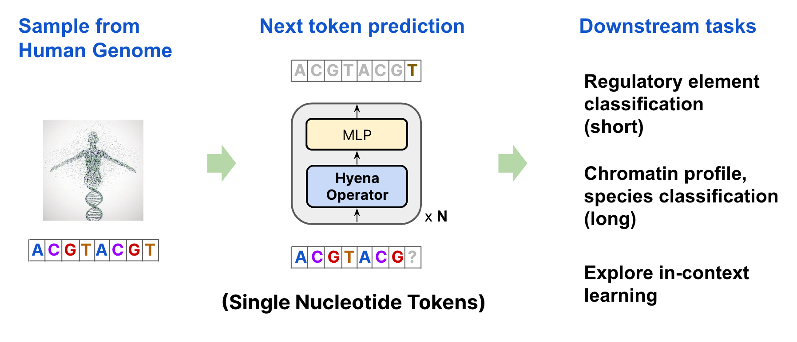

# HyenaDNA



## Important links:  
- [arxiv](https://arxiv.org/abs/2306.15794)  
- [blog](https://hazyresearch.stanford.edu/blog/2023-06-29-hyena-dna)
- [colab](https://colab.research.google.com/drive/1wyVEQd4R3HYLTUOXEEQmp_I8aNC_aLhL?usp=sharing)  
- [huggingface](https://huggingface.co/LongSafari)
- [discord](https://discord.gg/RJxUq4mzmW)
- [youtube (talk)](https://youtu.be/haSkAC1fPX0?si=IUMmo_iGZ6SK1DBX)

## Intro

Welcome to the HyenaDNA repo! HyenaDNA is a long-range genomic foundation model pretrained on context lengths of up to \***1 million tokens**\* at \***single nucleotide resolution**\*. 

The repo is a work in progress, but we're very excited to get this in the hands of researchers, so bare with us :)

This repo is best suited for those who want to pretrain a HyenaDNA model, or try one of the downstream tasks from the paper.

For the easiest entry point though, check out the HyenaDNA **[colab](https://colab.research.google.com/drive/1wyVEQd4R3HYLTUOXEEQmp_I8aNC_aLhL?usp=sharing)**, a self contained notebook that is Huggingface integrated. You'll be able to load pretrained weights and fine-tune on the GenomicBenchmarks dataset. Also, you'll be able to do inference and get embeddings on DNA sequences up to 450k nucleotides on the free tier. For 1 million long DNA sequences, you can get an A100 on Colab (paid tier), or run the notebook on your own machine.

  
Credit: much of the code is forked and extended from [S4](https://github.com/HazyResearch/state-spaces) and [Safari](https://github.com/HazyResearch/safari).

## Discord

Trying [Discord](https://discord.gg/RJxUq4mzmW) out! Maybe it'll be conducive to sharing ideas / tips on how HyenaDNA could be applied in different ways. Feel free to post questions there.

## Hugging Face pretrained weights
<a name="huggingface"></a>

Check these out :)  There are different model sizes, and different training sequence lengths that they can handle up to. All pretrained on a single human reference genome (hg38).

- [tiny-1k](https://huggingface.co/LongSafari/hyenadna-tiny-1k-seqlen/tree/main)
- [tiny-1k-d256](https://huggingface.co/LongSafari/hyenadna-tiny-1k-seqlen-d256/tree/main)
- [tiny-16k-d128](https://huggingface.co/LongSafari/hyenadna-tiny-16k-seqlen-d128/tree/main)
- [small-32k](https://huggingface.co/LongSafari/hyenadna-small-32k-seqlen/tree/main)
- [medium-160k](https://huggingface.co/LongSafari/hyenadna-medium-160k-seqlen/tree/main)
- [medium-450k](https://huggingface.co/LongSafari/hyenadna-medium-450k-seqlen/tree/main)
- [large-1m](https://huggingface.co/LongSafari/hyenadna-large-1m-seqlen/tree/main)

See the suggested [GPU requirements](https://huggingface.co/LongSafari/hyenadna-tiny-1k-seqlen#hardware) for each model.

There's a few way to use these HuggingFace weights, all with different flavors:

1. [colab](https://colab.research.google.com/drive/1wyVEQd4R3HYLTUOXEEQmp_I8aNC_aLhL?usp=sharing)  
2. [Pytorch Lighting in this repo](#loadweights)
3. [standalone](#standalone)

## Dependencies
<a name="dependencies"></a>

For this repo, let's start with the dependancies that are needed. (If you're familiar with Docker, you can skip this section and jump to the [docker](#docker) setup below). The repo is built using Pytorch Lightning (a training library) and Hydra a config oriented ML library. (It'll be super helpful to get familiar with those tools.)

- clone repo, cd into it

```
git clone --recurse-submodules https://github.com/HazyResearch/hyena-dna.git && cd hyena-dna
```

- create a conda environment, with Python 3.8+

```
conda create -n hyena-dna python=3.8
```

- The repo is developed with Pytorch 1.13, using cuda 11.7

```
conda install pytorch==1.13.0 torchvision==0.14.0 torchaudio==0.13.0 pytorch-cuda=11.7 -c pytorch -c nvidia
```

- install requirements:
```
pip install -r requirements.txt
```
- install Flash Attention, these [notes](https://github.com/HazyResearch/safari#getting-started) will be helpful.
```
cd hyena-dna
git submodule update --init
cd flash-attention
git submodule update --init
pip install -e . --no-build-isolation
```
- optional fused layers for speed (takes a bit of time)
```
# from inside flash-attn/
cd csrc/layer_norm && pip install . --no-build-isolation
```

## Dockerfile
<a name="docker"></a>

Even better, if you're familar with Docker, we have an image you can pull with all the dependencies installed. It's the simplest, surest, but does require some familiarity with using Docker containers.

Slight complication - you also need to clone the `flash-attn` repo that's used as a submodule in the main `hyena-dna` repo. That means you need the `--recurse-submodules` flag, in case you cloned without it.

```
# clones main and submodule repos
git clone --recurse-submodules https://github.com/HazyResearch/hyena-dna.git && cd hyena-dna

```

Prepare docker container
```
# build the image within the hyena-dna repo (it will grab the Dockerfile here).  You need to place $USER_NAME with your own Dockerhub username.
docker build . -t $USER_NAME/hyena-dna

Or,

# pull already built image (our $USER_NAME is hyenadna)
docker pull hyenadna/hyena-dna:latest

# run the container: this will give you an interactive shell with the dependencies
docker run --gpus all -it -p80:3000 hyenadna/hyena-dna /bin/bash
```

Update:
<a name="docker_nt"></a>

We actually have a second Docker image, which has all the Nucleotide Transformer datasets, checkpoint, and exact commands and hyperparameter settings used to reproduce the best results in the HyenaDNA paper.

```
docker pull hyenadna/hyena-dna-nt6:latest 
docker run --gpus all -it -p80:3000 hyenadna/hyena-dna-nt6 /bin/bash

```

This will land you inside the `/wdr`, which has a file named `launch_commands_nucleotide_transformer` with all the launch commands and (associated hyperparameters) for the 18 Nucleotide Transformer datasets.

What's the difference with the first Docker image you ask?  Not much, just some different dependancy versions.


## Quick Entry point 

A quick start for this the repo is to train from scratch on a small genomics dataset. Let's try this just to see if things are set up ok.

The command below should auto-download a small dataset into `data/`. It uses a small 2 layer HyenaDNA model with a linear decoder (head) on a binary classification task. It already beats the SotA by 7 pts (one task from GenomicBenchmarks), but we can do even better with a pretrained model.

```
python -m train wandb=null experiment=hg38/genomic_benchmark_scratch
```

Let's describe this.

<a name="quick"></a>
- `-m` lets you run the script as a module (no .py used in name).  
- `train` is calling the main `train.py` script that launches all training / finetuning experiments.
- `wandb=null`, this connects to wandb too, but for quick testing I set to null.  Otherwise you can use something like `wandb.group=custom_name_here`.
- `experiment` is passing the config for `experiment`, using the `genomic_benchmark_scratch.yaml` file, located in `configs/experiments/hg38/`.
- You can pass other configs in the command line the same way, eg, `dataset=your_custom_datset_name`.  But more on that later.

## Loading pretrained weights
<a name="loadweights"></a>

There are 2 ways to use the pretrained weights from HuggingFace:
1. HuggingFace integration (best example), via [colab](https://colab.research.google.com/drive/1wyVEQd4R3HYLTUOXEEQmp_I8aNC_aLhL?usp=sharing)
2. Pytorch Lightning in this repo:
- You can clone the HuggingFace repo, and pass the ckpt path to Pytorch Lighting (the .ckpt is from Lightning actually)
- the flag is `train.pretrained_model_path=/path/to/ckpt`
- you'll need to make sure the model config settings are the same when launching. The config is also in the HuggingFace repo.


## Standalone code (HuggingFace too)
<a name="standalone"></a>

We actually have a 3rd way, but it's really just a copy of the colab but put into this repo as a `.py` file (in case that's more your thing). It's HuggingFace integrated, not Pytorch Lightning, so you don't get all the bells and whistles, but it is standalone, meaning it's easier to port to your own codebase.  It assumes you have all the [dependencies](#dependencies) installed already.

- see the `huggingface.py` script for example of inference, loading pretrained weights from HF
- and the `standalone_hyenadna.py`, which has all the classes you need to create a HyenaDNA model


## Experiments

We share our training and dataloading code for pretraining on the human reference genome (HG38), fine-tuning on a number of downstreams, and examples of our in-context learning variants using soft prompt tokens and instruction fine-tuning. You'll need to download and preprocess on your own for now, we'll share our steps for those later.

In general, get comfortable with the configs in `configs/experiments/hg38`, all our (sample) experiment settings are there.

### Pretraining on Human Reference Genome
<a name="pretraining"></a>

First step is download the Human Reference Genome data. It's comprised of 2 files, 1 with all the sequences (the .fasta file), and with the intervals we use (.bed file).

The file structure should look like
```
data
|-- hg38/
    |-- hg38.ml.fa
    |-- human-sequences.bed

```

- Download fasta (.fa format) file (of the entire human genome) into hyena-dna/data/hg38.  ~24 chromosomes in the whole genome (merged into 1 file), each chromosome is a continuous sequence, basically. Then download the .bed file with sequence intervals (contains chromosome name, start, end, split, which then allow you to retrieve from the fasta file)  

```
mkdir -p data/hg38/
curl https://storage.googleapis.com/basenji_barnyard2/hg38.ml.fa.gz > data/hg38/hg38.ml.fa.gz
curl https://storage.googleapis.com/basenji_barnyard2/sequences_human.bed > data/hg38/human-sequences.bed
```

launch pretraining run  

```
python -m train wandb=null experiment=hg38/hg38_hyena model.d_model=128 model.n_layer=2 dataset.batch_size=256 train.global_batch_size=256 dataset.max_length=1024 optimizer.lr=6e-4 trainer.devices=1
```

Let's describe a little about this command.  
- `experiment=hg38/hg38_hyena` passes the config for this experiment using a Hyena(DNA) model
- `model.d_model=128`, and `model.n_layer=2` select the model width and depth, key hyparams
- `dataset.max_length=1024` sets the max sequence length sampled from the dataset, the model layer max length is set from this too, or...
- `model.layer.l_max`  # you can set the max model length manually
- `model.d_inner`  # likewise, the reverse bottleneck with can be set manually too (default is 4x d_model)

Lots of other commands you can pass and customize, feel free to check out the `experiment=hg38/hg38_hyena` for details.

### Pretraining on your own data
<a name="pretraining_custom"></a>

To pretrain on your own data, all you need is (ideally) a `.fasta` file.  You don't need a .bed file like we used for HG38, we just used that for convenience.  You can follow our species classification dataloader for how to setup a general pretraining dataloader that would randomly sample a chromosome and then a sequence of a given length.  

Sample pretraining dataloader  
```
src/dataloaders/datasets/species_dataset.py
```

The species dataloader can be used for pretraining as well by swapping out the .fasta file (for your own) and doing some wrangling with the configs.  There is also some code change to map the actual chromosomes you have in your .fasta file, so you'll have to dive into the code and what the dataloader is doing.  Most of the work in general for using this repo is just setting up dataloaders and configs (which takes time, but it's worth it!).

Note: if you plan on pretraining on your own data, make sure to preprocess your data correctly, and your samples are what you expect in the dataloader. Things like, uppercase/lowercase, unknown characters, etc. Also, if your sequences are variable length (in our setting we used fixed lengths mostly, since next token prediction should theoretically be introduced to variable length sequences) then the padding may become significant or an issue. ie, if your length range is 100-32k, then the 100 sequence will have a lot of padding, so you'll need to ignore those tokens in the loss to avoid instability in training. The padding token should be `4` by default, so you can pass this in the command line, `+task.loss.ignore_index=4`, or modify the config too (under `task.loss`).

### GenomicBenchmarks
<a name="genomicbenchmarks"></a>

The [GenomicBenchmarks](https://github.com/ML-Bioinfo-CEITEC/genomic_benchmarks) is an easy to use set of datasets for sequence level classification. We use as a good entry point to try new things out.

Sample run:
```
python -m train wandb=null experiment=hg38/genomic_benchmark dataset_name=human_enhancers_cohn train.pretrained_model_path=/path/to/ckpt dataset.max_length=500 model.layer.l_max=1024
```

This runs a HyenaDNA model on one of the datasets, auto-downloaded into `data/`. Here are the other datasets and their stats, which you can pass into this config too. The config in `configs/dataset/genomic_benchmark` is setup to pull in the correct dataset metadata (num_samples, classes, etc). 

Just like the [quick entry point](#quick) explained above, you'll need to set the flags for `dataset.max_length` you want to use, as well as the `model.layer.l_max`, which tells the model the max length you want to use. The inputs will be padded up to `model.layer.l_max`.  eg, data sample = 500, and `l_max` = 1024, then it will pad 501 to `l_max`.

The new flag here for this fine-tune experiment is to pass a pretrained ckpt via `train.pretrained_model_path=/path/to/ckpt`.


There are 8 datasets in this suite, choose 1 at a time (passing the `dataset.dataset_name` sets the num_classes and num_seqs automatically).
```
# name                                num_seqs        num_classes     median len    std
# dummy_mouse_enhancers_ensembl       1210            2               2381          984.4  
# demo_coding_vs_intergenomic_seqs    100_000         2               200           0
# demo_human_or_worm                  100_000         2               200           0
# human_enhancers_cohn                27791           2               500           0
# human_enhancers_ensembl             154842          2               269           122.6
# human_ensembl_regulatory            289061          3               401           184.3
# human_nontata_promoters             36131           2               251           0
# human_ocr_ensembl                   174756          2               315           108.1
```

### Nucleotide Transformer datasets

You can check out the [Nucleotide Transformer](https://www.biorxiv.org/content/10.1101/2023.01.11.523679v1) paper appendix for how to download and process the datasets. 

If you'd like to use the pretrained weights we used to finetune on, you'll need the [tiny-1k-d256](https://huggingface.co/LongSafari/hyenadna-tiny-1k-seqlen-d256/tree/main) weights on Huggingface.

Update:  Or, you can invest a bit of time and learn how use Docker, and just use our [pre-built Docker image](#docker_nt) that has the exact Nucleotide Transformer datasets/splits, pretrained weights, and hyperparameters used to obtain the results in the HyenaDNA paper (by far most convenenient way to reproduce results).

sample run  
```
# trains from scratch
python -m train wandb=null experiment=hg38/nucleotide_transformer dataset_name=enhancer dataset.max_length=500 model.layer.l_max=1026
```

Similarly with GenomicBenchmarks, we need to select which dataset to use from the 17 Nucleotide Transformer datasets.

See the dataset config in `configs/dataset/nucleotide_transformer` for more dataset metadata, but here's some:

```
Fields
name max_len n_classes n_samples metric

# enhancer 200   2  14968 MCC
# enhancer_types 200   3  14968 MCC
# H3 500   2  13468 MCC
# H3K4me1  500   2  28509 MCC
# H3K4me2  500   2  27614 MCC
# H3K4me3  500   2  33119 MCC
# H3K9ac   500   2  25003 MCC
# H3K14ac  500   2  29743 MCC
# H3K36me3 500   2  31392 MCC
# H3K79me3 500   2  25953 MCC
# H4 500   2  13140 MCC
# H4ac  500   2  30685 MCC
# promoter_all   300   2  53276 F1
# promoter_non_tata 300   2  47759 F1
# promoter_tata  300   2  5517  F1
# splice_sites_acceptor   600   2  19961 F1
# splice_sites_donor   600   2  19775 F1
```

The file structure for the data should look like:

```
data
|-- nucleotide_transformer/
    |-- enhancer/
        |-- all_test_enhancer.fasta
        |-- all_train_enhancer.fasta
    |-- H3/
        |-- H3_test.fasta
        |-- H3_train.fasta
    |-- promoter_tata/
        |-- promoter_tata_test.fasta
        |-- promoter_tata_train.fasta
    |-- ...

```


### In-context Learning

We use the [GenomicBenchmarks](#genomicbenchmarks) for exploring in-context learning (ICL). It should autodownload the data into `data/`.

Soft prompting example run:  
```
python -m evals/soft_prompting_genomics
```

instruction fine-tune example:  
```
python -m evals/instruction_tuned_genomics
```

### Chromatin Profile

You'll need to see the [DeepSea](https://www.nature.com/articles/nmeth.3547) and [repo](https://github.com/FunctionLab/sei-framework) for info how to download and preprocess.


example chromatin profile run:   
```
python -m train wandb=null experiment=hg38/chromatin_profile dataset.ref_genome_path=/path/to/fasta/hg38.ml.fa dataset.data_path=/path/to/chromatin_profile dataset.ref_genome_version=hg38
```

- `dataset.ref_genome_path`  # path to a human ref genome file (the input sequences)
- `dataset.ref_genome_version`  # the version of the ref genome (hg38 or hg19, we use hg38)
- `dataset.data_path`  # path to the labels of the dataset


### Species Classification

You'll need to download fasta files for each species that you want to use (just the .zips, the dataloader wil unzip automatically). You can download them using the following commands:

```
# Human
wget -P human/ -r -nH --cut-dirs=12 --no-parent ftp://ftp.ncbi.nlm.nih.gov/genomes/all/GCA/009/914/755/GCA_009914755.4_T2T-CHM13v2.0/GCA_009914755.4_T2T-CHM13v2.0_assembly_structure/Primary_Assembly/assembled_chromosomes/FASTA/
# Lemur
wget -P lemur/ -r -nH --cut-dirs=11 --no-parent ftp://ftp.ncbi.nlm.nih.gov/genomes/genbank/vertebrate_mammalian/Lemur_catta/latest_assembly_versions/GCA_020740605.1_mLemCat1.pri/GCA_020740605.1_mLemCat1.pri_assembly_structure/Primary_Assembly/assembled_chromosomes/FASTA/
# House mouse
wget -P mouse/ -r -nH --cut-dirs=11 --no-parent ftp://ftp.ncbi.nlm.nih.gov/genomes/genbank/vertebrate_mammalian/Mus_musculus/latest_assembly_versions/GCA_921998355.2_A_J_v3/GCA_921998355.2_A_J_v3_assembly_structure/Primary_Assembly/assembled_chromosomes/FASTA/
# Pig
wget -P pig/ -r -nH --cut-dirs=11 --no-parent ftp://ftp.ncbi.nlm.nih.gov/genomes/genbank/vertebrate_mammalian/Sus_scrofa/latest_assembly_versions/GCA_002844635.1_USMARCv1.0/GCA_002844635.1_USMARCv1.0_assembly_structure/Primary_Assembly/assembled_chromosomes/FASTA/
# Hippo
wget -P hippo/ -r -nH --cut-dirs=11 --no-parent ftp://ftp.ncbi.nlm.nih.gov/genomes/genbank/vertebrate_mammalian/Hippopotamus_amphibius/latest_assembly_versions/GCA_023065835.1_ASM2306583v1/GCA_023065835.1_ASM2306583v1_assembly_structure/Primary_Assembly/assembled_chromosomes/FASTA/
```

Your folder struture should look like this:  

```
data
|-- species/
    |-- chimpanzee/
        |-- chr1.fna
        |-- chr2.fna
        |-- ...
    |-- hippo/
        |-- chr1.fna
        |-- chr2.fna
        |-- ...
    |-- human/
        |-- chr1.fna
        |-- chr2.fna
        |-- ...
    |-- mouse/
        |-- chr1.fna
        |-- chr2.fna
        |-- ...
    |-- orangutan/
        |-- chr1.fna
        |-- chr2.fna
        |-- ...
    |-- other species ...
|-- ...
```


Sample species run: 
```
python -m train wandb=null experiment=hg38/species dataset.species=[human,mouse,hippo,pig,lemur] train.global_batch_size=256 optimizer.lr=6e-5 trainer.devices=1 dataset.batch_size=1 dataset.max_length=1024 dataset.species_dir=/path/to/data/species/ model.layer.l_max=1026 model.d_model=128 model.n_layer=2 trainer.max_epochs=150 decoder.mode=last train.pretrained_model_path=null train.pretrained_model_state_hook=null
```

Let's break some of these args down:
- `experiment=hg38/species`  # main config for this experiment
- `dataset.species`  # list of species you want (and already downloaded their .fasta files)
- `decoder.mode=last`  # using the last token to classify (instead of default pooling)
- `train.pretrained_model_path`  # if using a pretrained model, point to it, if not, set to null
- `train.pretrained_model_state_hook=null`  # if using a pretrained model, this will load the weights properly (and not head). if not, set to null


# More advanced stuff below


## Setting up downstream experiments (fine tuning)

Let's see what's needed to set up a downstream task.

The main ingredients are:

1. Model weights and model config (which are provided via [HuggingFace](#huggingface) at the top)
2. Custom dataset class and dataloader class
3. Configs for `experiment`, `dataset`, `pipeline`, `model`. Don't worry, we have examples for each of these.


Again, example run, breakdown in launch command:  
```
python -m train wandb=null experiment=hg38/genomic_benchmark
```

### Model config:

We talked about some of the model config setting [above](#pretraining). We placed the model config within the experiment config for convenience (which can override, basically), but you can place in the `configs/model` dir if you want. There is a separate layer config at `configs/model/layer`. This is where it's useful to understand the Hydra config stuff.

#### Flags for using ultralong context (gradient checkpointing)

We have a checkpoint flag that allows ~3x less memory on a GPU (to enable longer sequences).  However, this means that you may have trouble loading checkpoints
if you don't set the flags correctly (they need to be True if it was pretrained with these, and False if not).

- `model.checkpoint_mixer: True`  # set true for memory reduction
- `model.checkpoint_mlp: True`  # set true for memory reduction

Note, if it's not in the config and you want to pass it in the commandline, you would add a `+` in front, like this:  `+model.checkpoint_mixer=True`

If you get an error (like below) with the state_dict keys not matching, it's likely due to these flags, so toggle these on/off

```
Missing key in pretrained model! backbone.layers.0.mixer.layer.filter_fn.bias
```

### Setting up a Dataset class

Here's a sample dataset class for a DNA downstream task.  

`src/dataloaders/datasets/genomic_bench_dataset.py`

It's basically a standard Pytorch dataset.  Place data in the `data/`, with something like `/data/your_custom_dataset_name`, so the repo can find it.

Here's a sample dataloader for a DNA downstream task.  There's some more actually connecting with the HyenaDNA repo required here.

`src/dataloaders/genomic_bench_dataloader.py`

Notice the name is placed with `_name_ = "genomic_benchmark"` as a class attribute. This name is how we find it. Also, we need to add the dataloader file
to the `__init__`, see the top of this script, `src/dataloaders/__init__.py`.

I would emulate this dataloader file.  It's basically a way for Pytorch lightning to handle a lot of the dataloading stuff in the background.  Pass params to the init that you need to create it.  Notice the `def setup()`, this is where the dataset class is instantiated.  `setup()` gets called in the training script (more on that later).

There are 3 dataloader functions that create the train/val/test dataloaders.  (In this example, the dataset only uses train and test dataloader.)

### Creating Configs

As mentioned above, the main config is the experiment config, and for our example, located here `configs/experiment/hg38/genomic_benchmark.yaml`.

You can think of each of these sections as their own configs too. eg, `model`, `task`, `optimizer` etc. You can write them in here, or have it referenced
at the top (as default or overide, subtle differences).

For a new dataset, we need a new `dataset` config and a `pipeline` config. These configs get passed when they're instantiated.  

The pipeline config hasn't been mentioned yet, but it's where we define a few different things. Take a look inside:

`configs/pipeline/genomic_benchmark.yaml` 

 Try to emulate this config too, which will get reference at the top of the `experiment` config.  We select the `optimizer`, `scheduler`, name of the `dataset`, the `task` (typically classification for these downsteams, but we have other options for the decoder). Don't worry about the `encoder`.  We do use a `decoder`, which is just a single MLP that maps the backbone to the number of classes we're trying to predict.  When you create the dataset class, it will require a `d_output` for the number of classes, and the `decoder` will automatically pull this attribute in the background, as well as the dimension of the backbone from `d_model`.  The `decoder` can also have options, like `pool`, where we average the token embeddings, or `last` or `first`, meaning which token we use for the MLP to learn from.

If want to train at different sequence lengths, there's a few places we would need to change too.  Namely, the dataset config and the model configs.  You could
change these in the `experiment` config, or individually setup defaults in the standalone `dataset` / `dataloader` configs too, up to you.

`dataset` config expects a `max_length` to be set.

`model.layer.l_max` expects a length too.  Usually set to the dataset max_length + 2

## Launch a finetuning experiment

```
# example downstream task
python -m train wandb=null experiment=hg38/genomic_benchmark train.pretrained_model_path=<path_to_ckpt>
```

The dataset will automatically download to the `data/` dir (probably), and it's not that large, ~5-10 min setup.  All you need to do is download the weights from [HuggingFace](#huggingface) above, and change the configs to match the model settings, and the dataset seq_len you want to use.  Might take some fumbling around to get right, but it'll be worth it! 

To describe this `experiment` config a little more, let's dive in.  It finetunes a HyenaDNA (GPT-like). Let's focus on the `train` arguments.

- `remove_test_loader_in_eval: true`  # no test set in this benchmark  
We have the option to remove an extra test_loader, eg, if val and test are the same.

- `pretrained_model_strict_load: False`  # false allows encoder/decoder to be used if new model uses it  
Set false to play nicely when loading pretrained weights

for loading backbone and not head, requires both of these flags below  
- `pretrained_model_path: /home/workspace/eric/safari-internal/outputs/2023-03-23/07-10-41-239444/checkpoints/val/loss.ckpt`
This is where we pass the pretrained model to use as a backbone

- `pretrained_model_state_hook`
- `_name_: load_backbone`
This is a custom hook function that will load the backbone properly with a new MLP decoder head for the downstream task.

- `freeze_backbone: false`  # seems to work much better if false (ie finetune entire model)  
We have the option to freeze here.

#### Loading a finetuned model

Next we'll show an example of loading weights (that were finetuned) on a downstream task (it will continue to train though).

- see weights from [HuggingFace](#huggingface) above.
- They are for a 2 layer, d_model=128 (width), with a max_length=1024 (sequence len)
- Place these somewhere in the repo, typically we place them in the `outputs/`dir.

The main things we need to do now are to update appropriate args in a config.

```
# path to config finetuned model config
safari-internal/configs/experiment/hg38/genomic_benchmark_load_finetuned_model.yaml
```

For this config, select the dataset you want to train with `dataset.dataset_name`, which we'll use `human_nontata_promoters`, since this is what the weights above are fine tuned on.

Next, you need to update `train.pretrained_model_path`: path_to_ckpt, to wherever you placed them in the repo.

Now we can launch a run with this:

```
python -m train wandb=null experiment=hg38/genomic_benchmark_load_finetuned_model
```

This will run the main `src/train.py` script.

Let's point out a few keys locations in the train.py script, since it's a little confusing where all the stuff gets called.

- loading weights occurs with the `train.py`, `def load_state_dict()` function.  It actually calls a custom state hook to load gracefully (in the `src/models/sequence/long_conv_lm.py`, inthe `load_backbone()` function.

- forward prop is done in the `def forward()` function, inside `SequenceLightning` module of `train.py`, but realy, it calls `self.task.forward()`, which actually makes the call to the model. That is to say, you need to go `src/tasks/tasks.py`, and fine `class LMTask`, and its `def forward()` function.  Here you'll see the actual call to the model.  Note, the decoder head (a single MLP for classification) is separate from the main model backbone (feature extractor).

### Sequence Length Warmup Callback

We have sequence length warmup scheduler, implemented using a callback, which will increase sequence length in stages during training.  Basically the script will check what epoch and "stage" the training is at, and update the dataset/dataloaders to the parameters for that stage.  Currently, you need to specify the stages manually in a config, the example config is at, and the relevant portion is at the bottom of the config, and here below too:

```
configs/experiment/hg38/hg38_hyena_seqlen_warmup_reload.yaml
```

Guidance:
You have to be careful to know ahead of time that the batch size and seq len will fit into memory for EACH stage.  

To make your dataloader compatible with the seqlen warmup, you need to implement an interface, which is `init_datasets()`. Here's what it looks like:


The sharp edges:

To use this callback, we'll use the sample config above, `configs/experiment/hg38/hg38_hyena_seqlen_warmup_reload.yaml`.  

You'll need to design the stages manually, ie, what epoch and seq len you want to gradually increase the seq len (and lower batch size).  Note, the `epochs` at each stage means how long we run that stage for (it's not cummulative).

```
callbacks:
  seqlen_warmup_reload:
    # epochs refers to how long to run at that stage (not cummulative!)
    # this is just a sample
    stage_params:
      - epochs: 2  # means run this stage for 2 epochs (0, and 1)
        seq_len: 1024
        batch_size: 256  # in the background, grad accum = 1, since train.global_batch_size=256
      - epochs: 2  # run for 2 epochs (2 and 3)
        seq_len: 2048
        batch_size: 128
      - epochs: 2  # run for epochs 4, 5
        seq_len: 4096  #
        batch_size: 64
      - epochs: 2  # epoch 6, 7
        seq_len: 8192  
        batch_size: 32
      - epochs: 4  #  epoch 8, 9, 10, 11
        seq_len: 16_384  # 
        batch_size: 16
      - epochs: 4  # epoch 12, 13, 14, 15
        seq_len: 32_768
        batch_size: 8
```

As for the other parameters you run in the command line that are important:

In the sample config, see the 

- `train.global_batch_size` don't forget to set this!  It will control the `accumulate_grad_batches` to keep the lr consistent each stage. eg, 256 or 128 typically (maybe 64 for very long seqs)
- `dataset.batch_size` now refers to the test (or final seq len and batch).  the test set will always be the same
- `dataset.max_length` now refers to the test (or final seq len and max_length).  the test set will always be the same
- `model.layer.l_max` needs to be set to the highest seq len +2 (the test set size)

Things to note:

Train dataset will change during training, but the test set will always be fixed.  The test len/batch size is set the normal way in your command launch, ie, `dataset.batch_size`, `dataset`.

### Getting logits from pretrained model
<a name="logits"></a>

Here's a simple [script](https://github.com/HazyResearch/hyena-dna/blob/main/evals/hg38_inference.py) to get the logits from a pretrained model.

This isn't automated, so you'll need to download the weights manually from HF, and place them locally somewhere. You need the model head to get the logits.

Difference from the [Huggingface](https://github.com/HazyResearch/hyena-dna/blob/main/huggingface.py): this script is meant for getting embeddings easily, which doesn't use the model head. We don't have a current use case for the logits yet, so there's some extra steps if you want those.

### Experimental

1. We have an experimental bidirectional implementation of HyenaDNA. We used this in a recent ablation on the GenomicBenchmarks dataset where we trained from scratch, ie, did not pretrain using masked language modeling via BERT. We compared this to the standard causal HyenaDNA, and the causal version performed better. But some people very much want a bidirectional HyenaDNA, so we provide one instantiation of this, of which there are many ways to do bidirectionalality.

In regards to how we implementated it, we simply manipulate the padding of the FFT convolution. Checkout the `src/models/sequence/hyena.py` script for more details (eg just search for `bidirectional`).

To use bidirectional, pass in the flag (at launch) `model.bidirectional=True`, that's it!  

Note, the codebase only supports bidirectional training from scratch on a downstream task, ie, no masked language model pretraining. It doesn't make sense to do causal pretraining using bidirectionalality, so use at your own risk!

2. For downstream tasks, we added an option to only use / average over masked tokens. We updated the GenomicBenchmarks and Nuc Trans dataset with this ability, see there dataset classes for how it's implemented. To use it:

- you need to also set the right config settings. See their experiment configs, eg, `/src/configs/experiment/hg38/genomic_benchmark.yaml`, and in particular, use `dataset.return_mask=True`, and `dataset.padding_side=right`
- you need to set the new task created, which is called `masked_multiclass`, also in the experiment config.  All this does (differently than before) is handle the passing of the masks correctly to the model.

In practice, for short range tasks with not a lot padding, we noticed it didn't make too much of a difference.  But if your sequences have a ton of padding, then this will definitely help. In the paper, we didn't use this, and had left side padding by default.


### Change Log / updates:

- Added more weights to [huggingface](#huggingface).
- Added [docker image](#docker_nt) with Nucleotide Transformer datasets, weights, and exact hyper parameters to reproduce results.
- There's an experimential bidirectional option added.  See [Experimental](#Experimental).
- We added an option to pass a mask and ignore padded tokens for downstream tasks.  See [Experimental](#Experimental).
- Added some tips on [pretraining](#pretraining_custom) your on your own data.
- Example to get [logits](#logits) from pretrained model.


## Citation

Feel free to cite us if you find our work useful :)  
```
@article{nguyen2023hyenadna,
      title={HyenaDNA: Long-Range Genomic Sequence Modeling at Single Nucleotide Resolution}, 
      author={Eric Nguyen and Michael Poli and Marjan Faizi and Armin Thomas and Callum Birch-Sykes and Michael Wornow and Aman Patel and Clayton Rabideau and Stefano Massaroli and Yoshua Bengio and Stefano Ermon and Stephen A. Baccus and Chris Ré},
      year={2023},
      eprint={2306.15794},
      archivePrefix={arXiv},
      primaryClass={cs.LG}
}
```
